---
## Author
author:
  name: Махин Макар Михайлович
  email: 1132250415@pfur.ru
  affiliation:
    - name: Российский университет дружбы народов
      country: Российская Федерация
      postal-code: 117198
      city: Москва
      address: ул. Миклухо-Маклая, д. 6

## Title
title: "Отчёт по лабораторной работе 2"
subtitle: "Архитектура компьютера"
license: "CC BY"
---

# Цель работы

Изучить идеологию и применение средств контроля версий.Приобрести практические навыки по работе с системой git.

# Порядок выполнения лабораторной работы

## Базовая настройка git

Сделал предварительную конфигурацию git.
Открыл терминал и ввел команды, указав имя и электронную почту владельца репозитория
(рис. [-@fig-001])

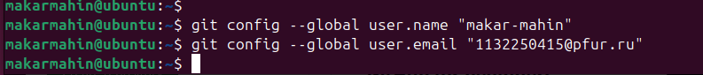{ #fig-001 width=70%, height=70% }

Настроил utf-8 в выводе сообщений git
рис. [-@fig-002])

{ #fig-002 width=70%, height=70% }

Задал имя начальной ветки(master)
рис. [-@fig-003])

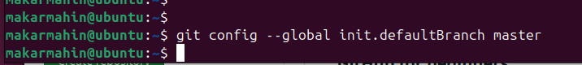{ #fig-003 width=70%, height=70% }

Ввел параметр autocrlf и safecrlf
рис. [-@fig-004])

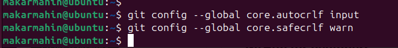{ #fig-004 width=70%, height=70% }

## Создание SSH ключа

Для следующий идентификации пользователя на сервера репозиториев сгенерировал пару ключей.(приватный и открытый)
(рис. [-@fig-005])

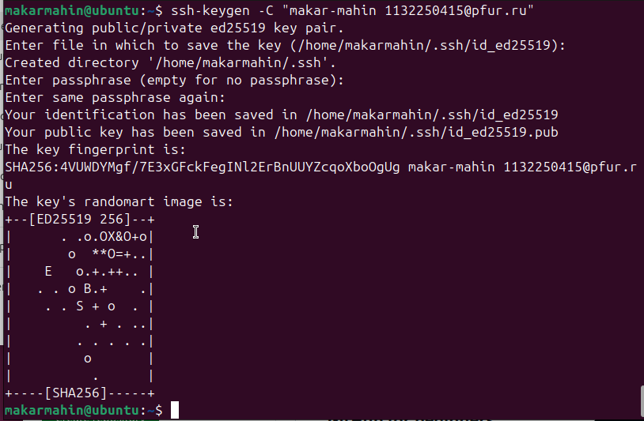{ #fig-005 width=70%, height=70% }

После генерации ключа загрузил открытый ключ ,скопировав из локальной консоли в 
буфер обмена. Вставил ключ в появившееся на сайте поле и указал 
для ключа имя(Title)(рис. [-@fig-006])

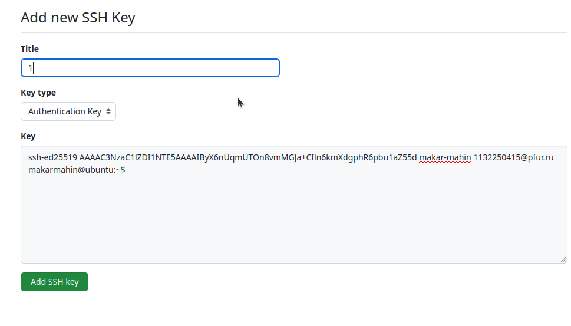{ #fig-006 width=70%, height=70% }

## Создание рабочего пространства и репозитория курса на основе шаблона

Открыл терминал и создал каталог для предмета “Архитектура компьютеров”
(рис. [-@fig-007])

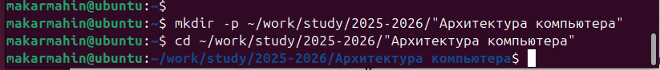{ #fig-007 width=70%, height=70% }

Создал репозиторий и задал имя
(рис. [-@fig-008])

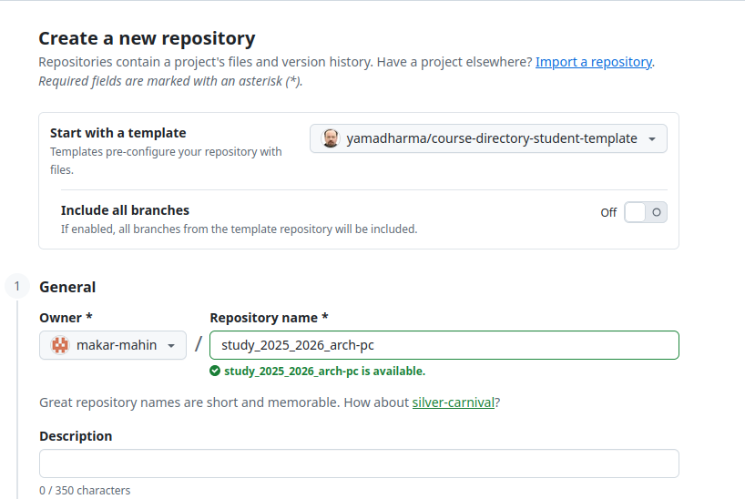{ #fig-008 width=70%, height=70% }

Открыл терминал и зашел в каталог курса.Клонировал созданный репозиторий.
(рис. [-@fig-009])

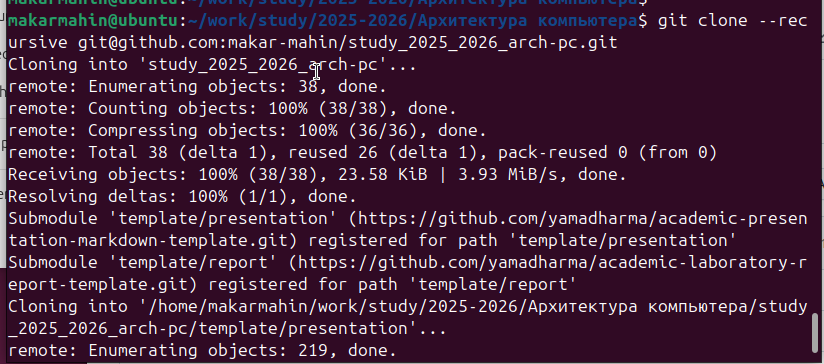{ #fig-009 width=70%, height=70% }

## Настройка каталога курса

Перешел в каталог курса
Удалил лишние файлы и создал необходимые каталоги.
(рис. [-@fig-010])

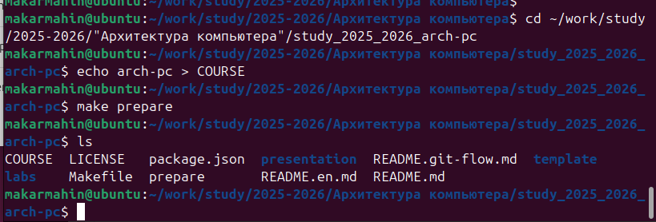{ #fig-010 width=70%, height=70% }

Отправил файлы на сервер.
(рис. [-@fig-011])

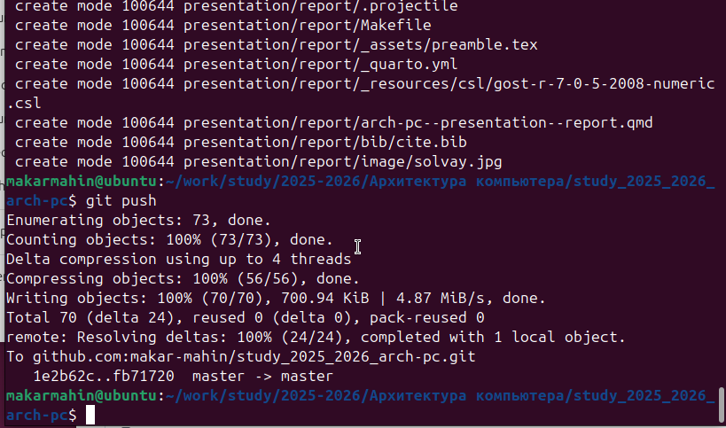{ #fig-011 width=70%, height=70% }

Проверил правильность создания иерархии рабочего пространства в локальном репозитории и на странице github.
(рис. [-@fig-012])

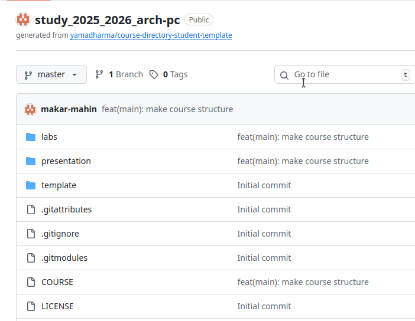{ #fig-012 width=70%, height=70% }

## Самостоятельная работа.

Добавил лабораторные в папки и загрузил на репозиторий. (рис. [-@fig-013])

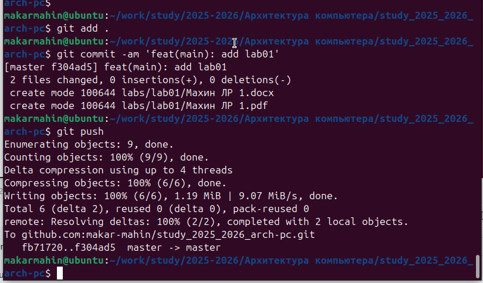{ #fig-013 width=70%, height=70% }

# Выводы

В ходе выполнения лабораторной работы я получил практические навыки работы с системой контроля версий Git. Я освоил основные команды, настроил рабочее пространство и репозиторий, а также успешно загрузил результаты на GitHub.
