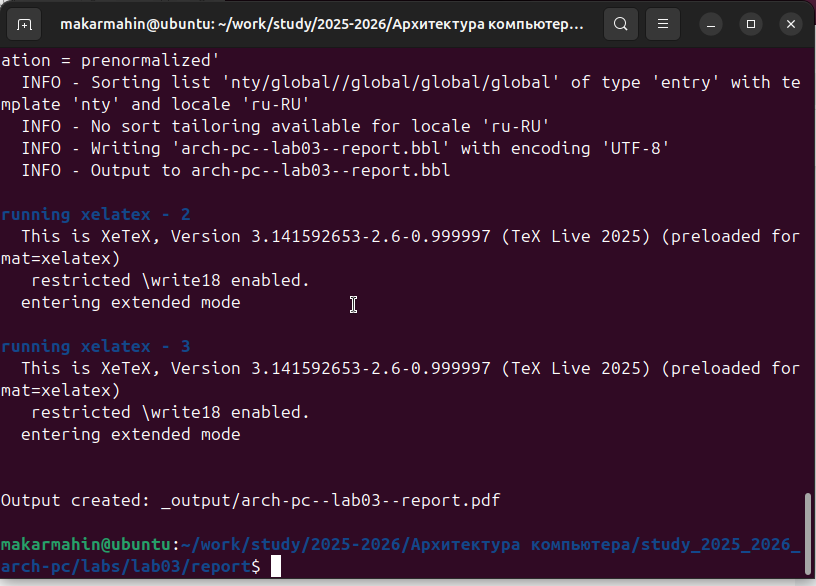
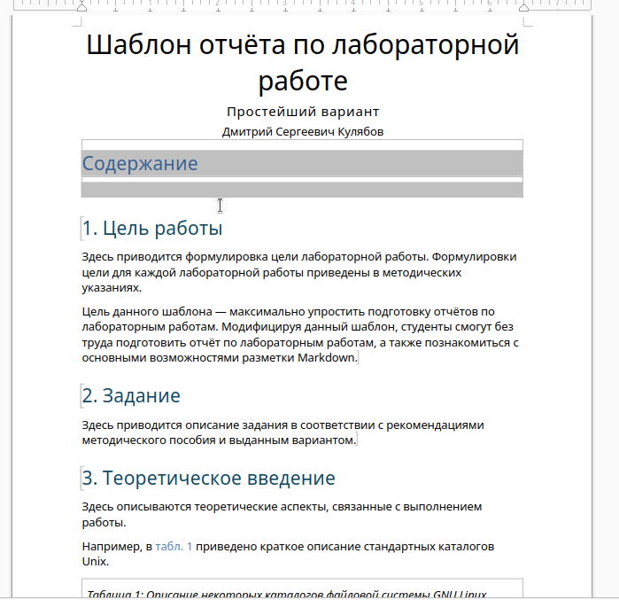
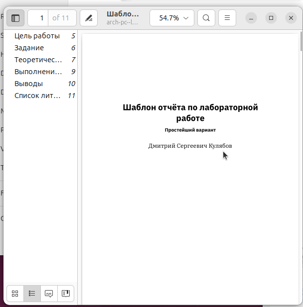
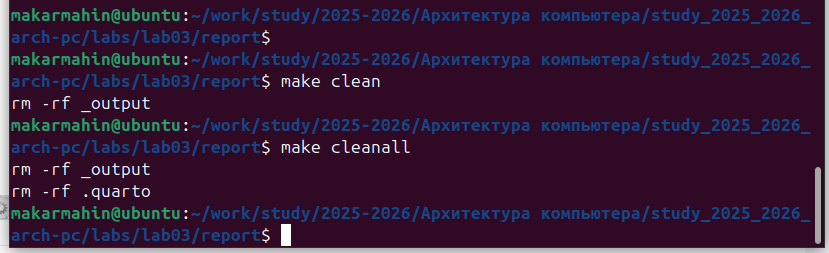
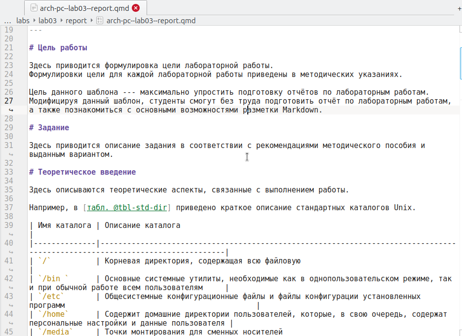
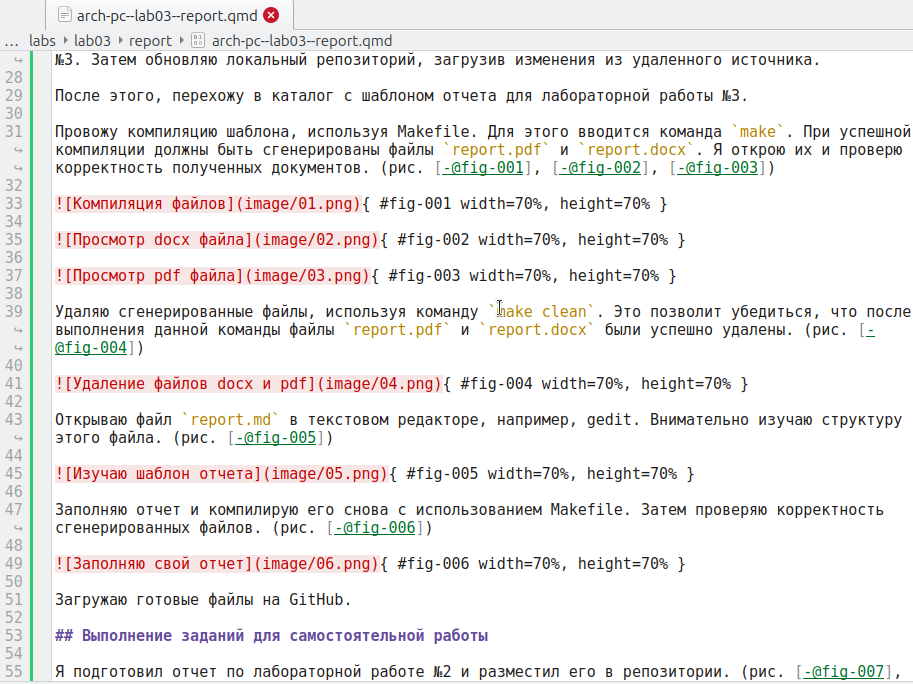
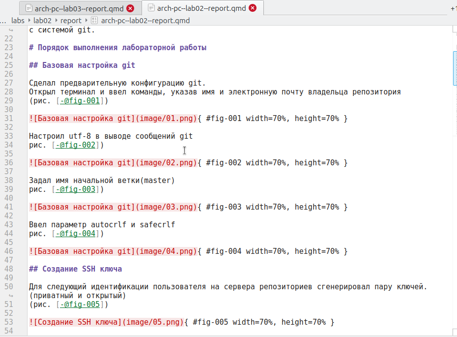
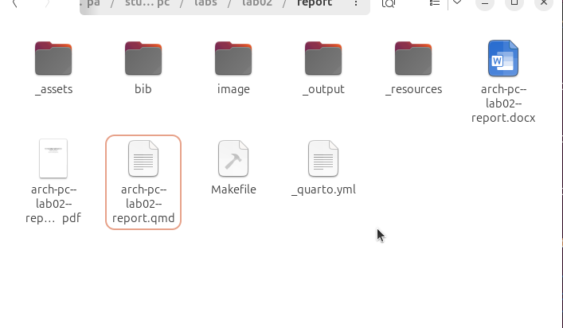

---
## Author
author:
  name: Махин Макар Михайлович
  email: 1132250415@pfur.ru
  affiliation:
    - name: Российский университет дружбы народов
      country: Российская Федерация
      postal-code: 117198
      city: Москва
      address: ул. Миклухо-Маклая, д. 6

## Title
title: "Отчёт по лабораторной работе 3"
subtitle: "Архитектура компьютера"
license: "CC BY"
---

# Цель работы

Целью данной работы является изучение процесса оформления отчетов с использованием легковесного языка разметки Markdown.

# Выполнение лабораторной работы

## Знакомство с Markdown

Открываю терминал и перехожу в каталог курса, созданный во время выполнения лабораторной работы №3. Затем обновляю локальный репозиторий, загрузив изменения из удаленного источника.

После этого, перехожу в каталог с шаблоном отчета для лабораторной работы №3.

Провожу компиляцию шаблона, используя Makefile. Для этого вводится команда `make`. При успешной компиляции должны быть сгенерированы файлы `report.pdf` и `report.docx`. Я открою их и проверю корректность полученных документов. (рис. [-@fig-001], [-@fig-002], [-@fig-003])

{ #fig-001 width=70%, height=70% }

{ #fig-002 width=70%, height=70% }

{ #fig-003 width=70%, height=70% }

Удаляю сгенерированные файлы, используя команду `make clean`. Это позволит убедиться, что после выполнения данной команды файлы `report.pdf` и `report.docx` были успешно удалены. (рис. [-@fig-004])

{ #fig-004 width=70%, height=70% }

Открываю файл `report.md` в текстовом редакторе, например, gedit. Внимательно изучаю структуру этого файла. (рис. [-@fig-005])

{ #fig-005 width=70%, height=70% }

Заполняю отчет и компилирую его снова с использованием Makefile. Затем проверяю корректность сгенерированных файлов. (рис. [-@fig-006])

{ #fig-006 width=70%, height=70% }

Загружаю готовые файлы на GitHub.

## Выполнение заданий для самостоятельной работы

Я подготовил отчет по лабораторной работе №2 и разместил его в репозитории. (рис. [-@fig-007], [-@fig-008])

{ #fig-007 width=70%, height=70% }

{ #fig-008 width=70%, height=70% }

# Выводы

В ходе выполнения данной лабораторной работы я изучил синтаксис языка разметки Markdown и научился генерировать отчеты из шаблонов с использованием Makefile, что значительно упростило процесс оформления документов.
