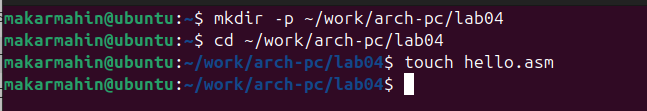
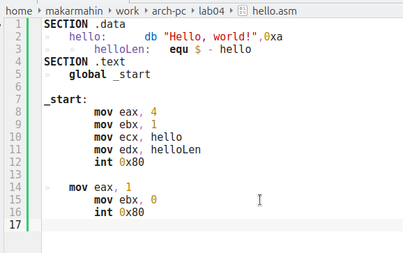
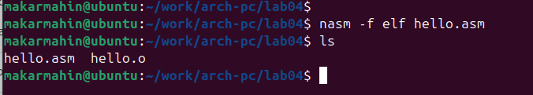
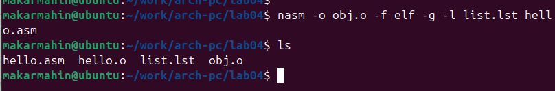
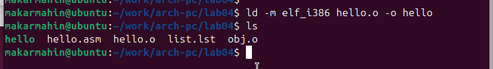
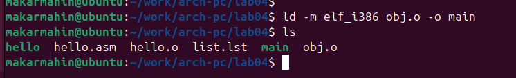
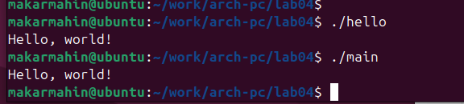
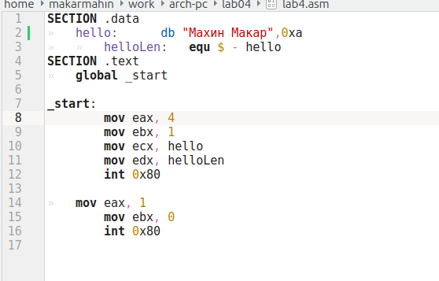
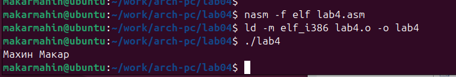

---
## Author
author:
  name: Махин Макар Михайлович
  email: 1132250415@pfur.ru
  affiliation:
    - name: Российский университет дружбы народов
      country: Российская Федерация
      postal-code: 117198
      city: Москва
      address: ул. Миклухо-Маклая, д. 6

## Title
title: "Отчёт по лабораторной работе 4"
subtitle: "Архитектура компьютера"
license: "CC BY"
---

# Цель работы

Целью работы является освоение процедуры компиляции и сборки программ, написанных на ассемблере NASM.

# Выполнение лабораторной работы

## Программа "Hello, World!"

В первую очередь создаю каталог `lab04` с помощью команды `mkdir`, после чего перехожу в него с помощью `cd` и создаю файл с именем `hello.asm`. (рис. [-@fig-001])

{ #fig-001 width=70%, height=70% }

Затем открываю созданный файл и реализую код программы согласно заданию. (рис. [-@fig-002])

{ #fig-002 width=70%, height=70% }

## Использование транслятора NASM 

Для трансляции файла использую команду `nasm`, в результате чего получаю объектный файл `hello.o`. (рис. [-@fig-003])

{ #fig-003 width=70%, height=70% }

Далее провожу трансляцию с дополнительными параметрами, что приводит к созданию файла листинга `list.lst`, объектного файла `obj.o`, а также к добавлению отладочной информации в программу. (рис. [-@fig-004])

{ #fig-004 width=70%, height=70% }

## Компоновка с помощью LD

Для компоновки использую команду `ld`, в результате чего получается исполняемый файл. (рис. [-@fig-005])

{ #fig-005 width=70%, height=70% }

Повторяю линковку для объектного файла `obj.o`, в результате чего создается исполняемый файл с именем `main`. (рис. [-@fig-006])

{ #fig-006 width=70%, height=70% }

Запускаю созданные исполняемые файлы для проверки их работы. (рис. [-@fig-007])

{ #fig-007 width=70%, height=70% }

## Выполнение заданий для самостоятельной работы

Копирую исходный код программы в новый файл.

Изменяю текст "Hello, World!" на свое имя (рис. [-@fig-008]) и запускаю измененную программу. (рис. [-@fig-009])

{ #fig-008 width=70%, height=70% }

{ #fig-009 width=70%, height=70% }

# Выводы

При выполнении данной лабораторной работы я освоил процесс компиляции и сборки программ, написанных на ассемблере nasm.

