---
## Author
author:
  name: Махин Макар Михайлович
  email: 1132250415@pfur.ru
  affiliation:
    - name: Российский университет дружбы народов
      country: Российская Федерация
      postal-code: 117198
      city: Москва
      address: ул. Миклухо-Маклая, д. 6

## Title
title: "Отчёт по лабораторной работе 5"
subtitle: "Архитектура компьютера"
license: "CC BY"
---

# Цель работы

Целью работы является приобретение практических навыков работы в Midnight Commander. 
Освоение инструкций языка ассемблера mov и int.

# Выполнение лабораторной работы

1. Открыл Midnight Commander и перешел в каталог ~/work/arch-pc. Создал новый каталог lab05 для работы.

   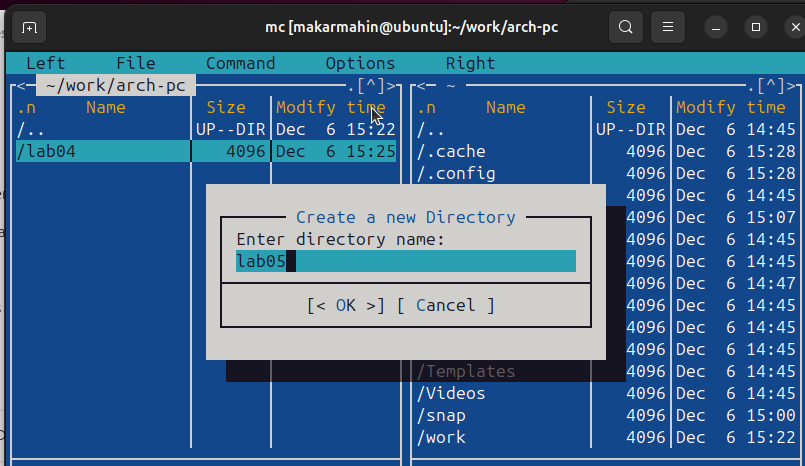{ #fig:001 width=70%, height=70% }

2. Создал файл lab05-1.asm, открыл его для редактирования и написал начальный код программы.

   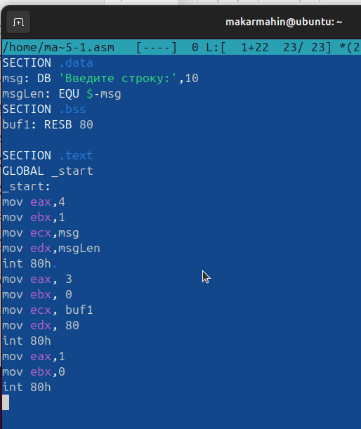{ #fig:002 width=70%, height=70% }

3. Открыл файл для просмотра и проверил корректность написанного кода.

   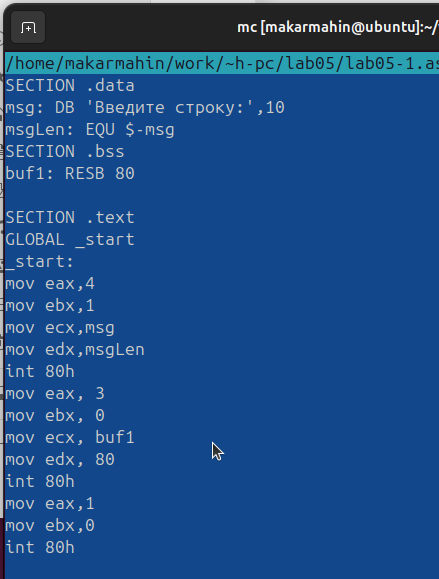{ #fig:003 width=70%, height=70% }

4. Скомпилировал файл и запустил полученный исполняемый файл, проверив его работоспособность.

   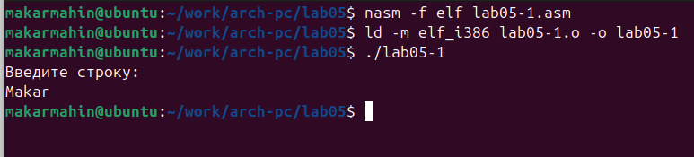{ #fig:004 width=70%, height=70% }

5. Скачал файл in_out.asm, добавил его в рабочий каталог. Скопировал файл lab05-1.asm и переименовал в lab05-2.asm.

   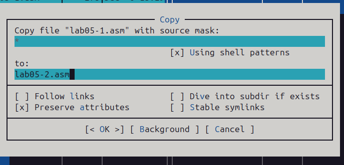{ #fig:005 width=70%, height=70% }

6. Написал код для программы lab05-2.asm, скомпилировал её и проверил корректность работы.

   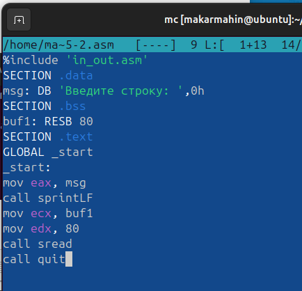{ #fig:006 width=70%, height=70% }

   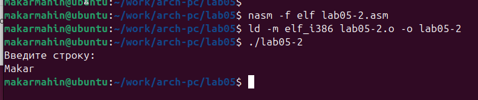{ #fig:007 width=70%, height=70% }

7. В файле lab05-2.asm заменил подпрограмму sprintLF на sprint. Пересобрал исполняемый файл. Теперь строка выводится без перехода на новую строку.

   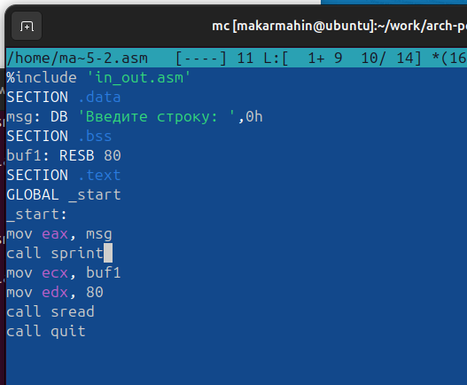{ #fig:008 width=70%, height=70% }

   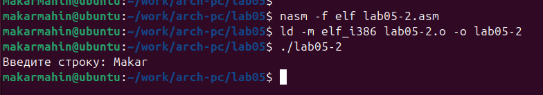{ #fig:009 width=70%, height=70% }

8. Скопировал программу lab05-1.asm и изменил код таким образом, чтобы:
   - Вывести приглашение типа “Введите строку:”.
   - Прочитать введённую строку с клавиатуры.
   - Вывести введённую строку на экран.

   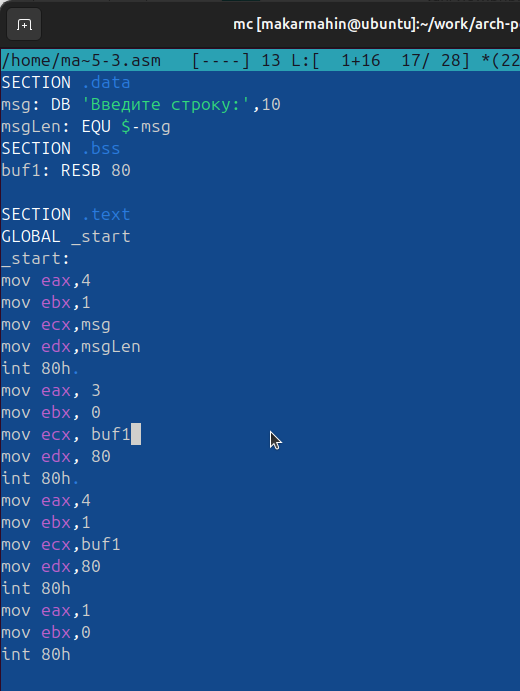{ #fig:010 width=70%, height=70% }

   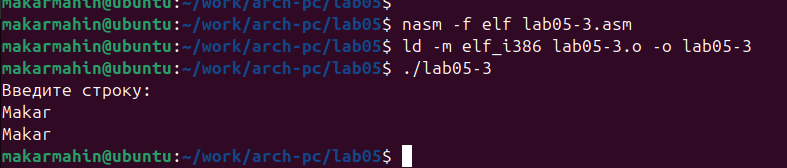{ #fig:011 width=70%, height=70% }

15. Скопировал программу lab05-2.asm и адаптировал её по аналогии с предыдущим заданием, используя возможности из файла in_out.asm.

   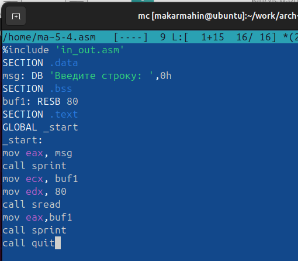{ #fig:012 width=70%, height=70% }

   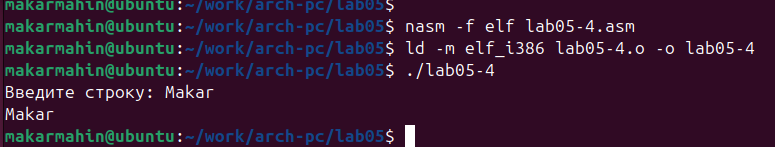{ #fig:013 width=70%, height=70% }

# Выводы

В ходе выполнения лабораторной работы были приобретены навыки написания базовых ассемблерных программ. Также освоены основные ассемблерные инструкции, такие как mov и int.

